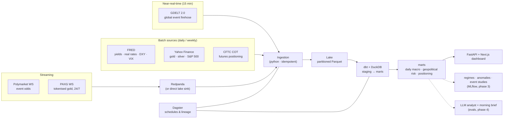
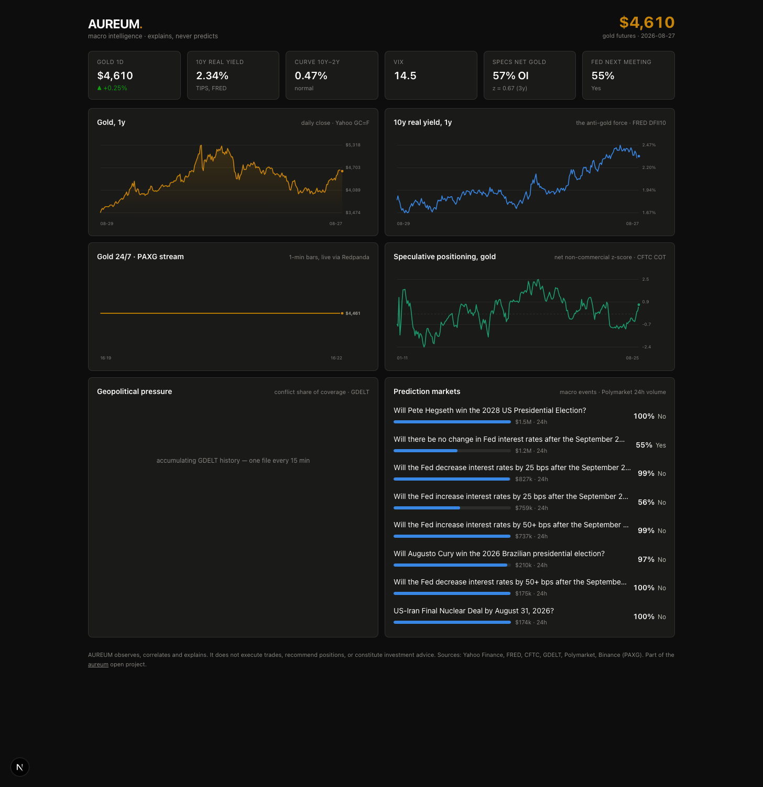

# AUREUM

**Real-time macro intelligence: what moves gold, bonds and the dollar — explained with data, not predicted with hope.**


## Why this exists

In my bachelor's thesis, [MarketLens](https://mlmarketlens.com), I benchmarked eight forecasting
families against the random walk with leak-free walk-forward validation. The result matched half a
century of literature: **predicting prices barely beats a coin toss, and the improvements — when
they exist — are marginal.**

AUREUM takes that conclusion seriously and builds the thing that *is* valuable: a data platform
that answers **"why is the market moving right now?"** with evidence. It ingests four worlds that
usually live apart — prices, macro rates, geopolitical events and prediction-market odds — lands
them in a lake, models them in a warehouse, and (in later phases) serves them through anomaly
detection, regime classification and an LLM analyst that cites its sources.

No price forecasts. No buy/sell language. Analytics, not advice.

## Architecture



## Data sources

| Source | What | Cadence | Auth | Landed as |
|---|---|---|---|---|
| Yahoo Finance (chart API) | Gold & silver futures, S&P 500 (daily OHLC) | Daily | none² | snapshot |
| [FRED](https://fred.stlouisfed.org) | 10y/2y yields, 10y real yield, curve slope, broad USD, VIX | Daily | none¹ | snapshot |
| [CFTC COT](https://www.cftc.gov) | Futures positioning (gold, 10y Treasury): who is long, who is short | Weekly | none | snapshot |
| [GDELT 2.0](https://www.gdeltproject.org) | Global news events with tone & conflict scores | 15 min | none | incremental |
| [Polymarket](https://polymarket.com) | Macro event odds: Gamma REST snapshot + CLOB WebSocket | Daily + streaming | none | snapshot + increment |
| Binance (PAXG) | Tokenised gold trades, 24/7 — alive when COMEX sleeps | Streaming | none | increment |

¹ FRED's WAF fingerprints clients and silently drops some of them (documented in the MarketLens
paper, §5.8); the connector degrades from `requests` to a `curl` subprocess before giving up.
² Stooq was the original pick but now serves a JS anti-bot challenge to non-browser clients —
the kind of thing free sources do, and the reason every connector fails soft and alone.

## What works today

```bash
make setup      # venv + install
make ingest     # pull all five batch sources into lake/raw/ (parquet)
make warehouse  # dbt build → data/aureum.duckdb (staging views + marts + tests)
make test       # offline unit tests for every parser
make broker     # Redpanda + console via docker compose
make stream     # PAXG + Polymarket WebSockets → micro-batched parquet
make api        # read-only JSON API over the warehouse (:8000)
make dashboard  # Next.js terminal-dark dashboard (:3000)
```

The streaming path runs with or without the broker: the lake sink is the
zero-infra default; `--sink kafka` publishes to Redpanda and
`aureum stream consume` drains topics back into the lake.

Then ask the warehouse something:

```sql
-- gold vs the 10y real yield, the classic macro pair
SELECT date, gold_usd, real_yield_10y, gold_return_1d
FROM mart_daily_macro ORDER BY date DESC LIMIT 10;
```

## Roadmap

- [x] **Phase 1 — Data platform**: batch ingestion (FRED, Stooq, CFTC, GDELT), parquet lake,
      dbt + DuckDB marts, unit-tested parsers, CI, Dagster schedules
- [x] **Phase 2 — Streaming + dashboard**: Polymarket & PAXG WebSockets → Redpanda → lake;
      FastAPI over the warehouse; Next.js dashboard (hand-rolled SVG charts, validated palette)
- [ ] **Phase 3 — ML with MLOps**: geopolitical risk index, risk-on/risk-off regime classifier,
      positioning/price anomaly detection; MLflow registry, scheduled retraining, drift monitoring
- [ ] **Phase 4 — LLM analyst**: tool-using agent over the warehouse ("why is gold up today?"),
      auto-generated morning brief, eval suite (groundedness, citation accuracy)

## Dashboard



Dark by design (a financial terminal, not a website), hand-rolled SVG charts —
2px lines, crosshair + tooltip, direct last-value labels — on a palette
validated for contrast and color-vision deficiency. One axis per chart, no
dual-axis tricks, and honest empty states while young streams accumulate.

## Design decisions & trade-offs

- **No forecasting, by design.** MarketLens already showed rigorously how little there is to gain.
  AUREUM's ML explains state (regimes, anomalies, event studies), it does not predict prices.
- **DuckDB over ClickHouse/Postgres.** Single file, zero ops, vectorised, reads the parquet lake
  in place. At 100× the volume I would move marts to ClickHouse and keep the lake as the source
  of truth — the dbt models would survive the move.
- **Snapshot + `latest.parquet` pattern.** Full-history sources (Stooq, FRED, COT) are cheap to
  re-pull, so each run lands a dated snapshot (audit trail) and atomically replaces a `latest`
  pointer that dbt reads. Append-only sources (GDELT) land incremental partitions keyed by the
  publisher's file id — re-runs are no-ops, so every job is safely retryable.
- **Keyless sources only in phase 1.** Anyone can clone and run `make ingest` with zero setup.
  Failures degrade to a logged warning, never a broken pipeline (a MarketLens principle).
- **`read_parquet()` in staging models instead of dbt external sources.** Less dbt-idiomatic,
  but keeps the lake→warehouse contract in one visible line per model.

## Cost

Runs end-to-end on a laptop for **€0/month**. The target deployment (VPS + Docker Compose,
like MarketLens) stays under **€10/month** — no managed cloud services required.

## Disclaimer

AUREUM observes, correlates and explains. It does not execute trades, does not recommend
positions, and does not constitute investment advice.
